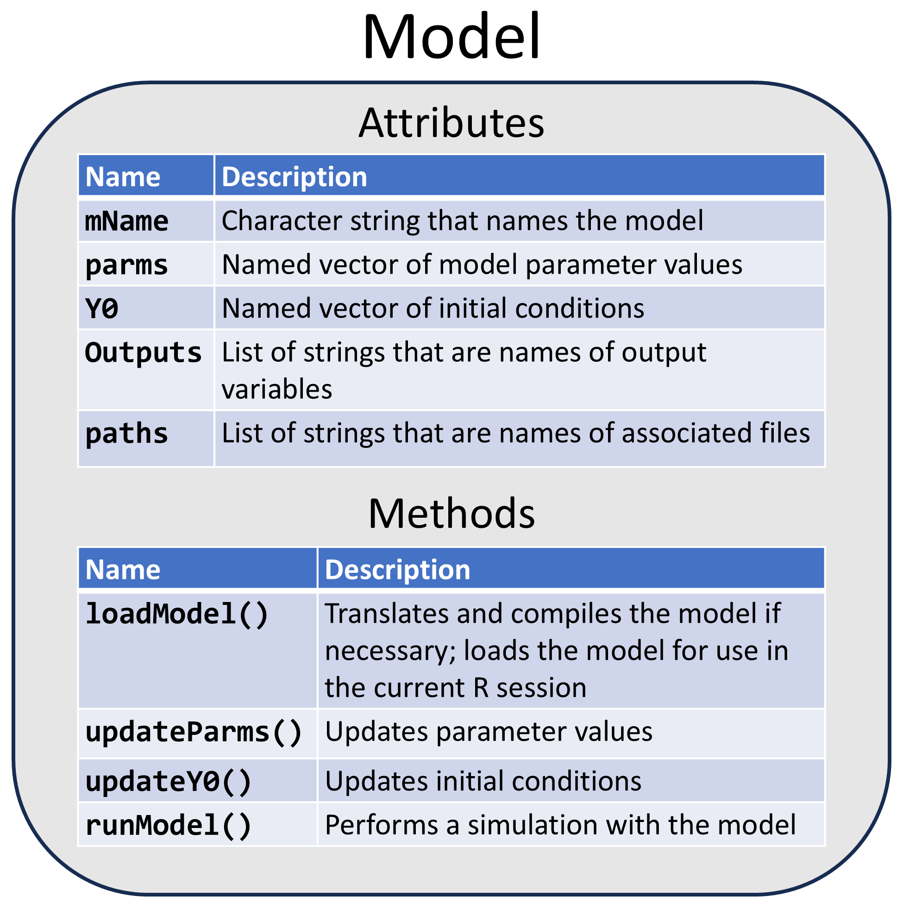

```{r setup, include = FALSE}
knitr::opts_chunk$set(
  echo = TRUE,
  warning = FALSE,
  collapse = TRUE,
  comment = "#>"
)
```

Many physical and biological phenomena can be described using mathematical models based on ordinary differential equations (ODEs). In such a model, an ODE describes how a "state variable" changes (quantitatively) with respect to an independent variable (e.g., time or position). In general, an ODE model can include several state variables, each with its own ODE, so the model can be expressed as a system of ODEs. Thus, if $y$ is a vector of $n$ state variables,
an ODE model that describes the state of the system at $t$ (i.e., at a specific time or value of the independent variable) can be expressed as
\begin{equation}
  \frac{\textrm{d}}{\textrm{d}t}y(t) = f(y(t), \theta, t),
\end{equation}
where $f$ is a vector-value function (of dimension $n$) and \theta is a vector of parameters (i.e., constants or variables other than state variables and the independent variable).

In order to obtain a specific solution for a system of ODEs, one must know the initial state of the system,
\begin{equation}
  y_0 = y(t_0),
\end{equation}
where $t_0$ is the inital value of the independent variable. This last equation is often described as a statement of the "initial conditions" of the system, and solving a system of ODEs subject to such initial conditions is called solving an initial value problem (IVP).

The **MCSimMod** package allows one to solve IVPs for ODE models described in the [MCSim](https://www.gnu.org/software/mcsim/) model specification language. Using **MCSimMod**, one can translate MCSim model specification text to C source code and then "compile" that code for use in R. This system enables users to take advantage of the flexibility and post hoc data analysis capabilities of the interpreted language R while also achieving computational speeds typically associated with compiled programming languages (like C and FORTRAN). Furthermore, this system encourages modelers to use separate files for defining models and executing model simulations, which can, in turn, improve modularity and reusability of source code developed for modeling analyses.

## Object-Oriented Design

**MCSimMod** was designed using the object-oriented programming paradigm, in which computer programs are based on objects that comprise attributes (i.e., data) and methods (i.e., functionality). In particular, the **MCSimMod** package defines a class called `Model` that provides a template for model objects. One creates a `Model` object (i.e., an instance of the `Model` class) to represent a given ODE model. As illustrated in Figure 1, a `Model` object has both attributes (i.e., things the object "knows" about itself) and methods (i.e., things the object can "do"). Model attributes include: the name of the model (`mName`); a vector of parameter names and values (`parms`); and a vector of initial conditions (`Y0`). Model methods include functions for: translating, compiling, and loading the model (`loadModel()`); updating parameter values (`updateParms()`); updating initial conditions (`updateY0()`); and running model simulations (`runModel()`). So, for example, if `mod` is a `Model` object, it will have an attribute called `parms` that can be accessed using the R expression `mod$parms`. Similarly, `mod` will have a method called `updateParms()` that can be accessed using the R expression `mod$updateParms()`.

```{r, echo = FALSE, fig.cap = "Figure 1: Model object schema", out.width = "50%"}

```

## Model Specification

A `Model` can be defined using either a text file or a text string written in the MCSim model specification language. Figure 2 shows an example of an MCSim model specification file and indicates its key components: (1) names of state variables; (2) names of other "output" variables (for which values are recalculated throughout a simulation); (3) names of "input" variables (which have user-provided values that may vary throughout a simulation); (4) names and default values of parameters (which are user-provided quantities that have constant values throughout a simulation); (5) instructions for initializing values of parameters and state variables; (6) instructions for calculating "dynamic" aspects of the model, including values of output variables and values of derivatives for each state variable (which are expressed as ODEs); and (7) the mandatory ending keyword. (More details about the structure of the model specification text are provided in a separate vignette: "Model Specification".)

```{r, echo = FALSE, fig.cap = "Figure 2: An example of an MCSim model specification", out.width = "50%"}

```

## Creating a Model object

One can create a new `Model` object using the function `createModel()`. It is necessary to supply (as an argument to the `createModel()` function) either a string (`mString`) or the name of a file (`mName`) that contains the model specification text. For example, if `mod_string` is a character string containing model specification text, one could use the following command to create a `Model` object from that string.

```{verbatim}
mod <- createModel(mString = mod_string)
```

Alternatively, one could save the model specification text in a file called `ex.model` and then use the following command to create a `Model` object from the file (assuming that the file is in the current working directory for the R session).

```{verbatim}
mod <- createModel(mName = "ex")
```

Note that the suffix (or file name extension) `.model` should be included in the name of file saved on the user's computer, but it should not be included in the `mName` character string argument that is passed to the function `createModel()`. One can also provide a full file system path for the argument mName (again excluding the suffix `.model`) as shown in the following example command.

```{verbatim}
mod <- createModel(mName = "/path/to/ex")
```

## Using a Model object

Once a `Model` object has been created, it can be loaded (i.e., made available for use in the current R session) by calling the method `loadModel()`. For a `Model` object called `mod`, the call to `loadModel()` would look like this.

```{verbatim}
mod$loadModel()
```

Calling the `loadModel()` method will, if necessary, translate the model specification text (to C) and compile the resulting C file to create a dynamic link library (DLL) file (on Windows operating systems) or a shared object (SO) file (on Unix operating systems). As illustrated in Figure 3, the translation and compilation process will create several additional files associated with the `Model` object. The additional files will be saved in a temporary directory by default; however, the user can instead mandate that the additional files be saved in same directory that contains the model specification file by passing the argument `writeTemp = FALSE` to the `createModel()` function (when the `Model` object is first created). The `loadModel()` method will carry out the translation and compilation steps (creating additional files) if: (1) the `Model` object was created with a string (rather than a file); (2) the machine code (DLL or SO) file associated with the model specification file cannot be found; (3) the model specification file has been modified since the translation and compilation steps were last completed; or (4) the user passes the argument `force = TRUE` to the `loadModel()` method. Otherwise, it will be assumed that the existing model files are up-to-date and the translation and compilation steps will be bypassed. After creating or identifying the required model files, the `loadModel()` method will load all essential information about the `Model` object into memory (for use in the current R session) and it will also assign default values to all parameters and all the initial values of the state variables associated with the `Model` object.

```{r, echo = FALSE, fig.cap = "Figure 3: Files associated with an MCSim Model object", out.width = "50%"}

```

After a `Model` object has been loaded, one can use the method `updateParms()` to modify the values of the parameters and the method `updateY0()` to modify the initial values of the state variables. Finally, one can perform a simulation (i.e., solve an IVP) with the `Model` by calling the `runModel()` method. One must pass (as an argument to `runModel()`) a vector of "times" (i.e., values of the independent variable) at which values of the state variables and output variables are desired, as shown in the following example command.

```{verbatim}
out <- model$runModel(times)
```

The `runModel()` method returns an R "matrix" data structure that includes a column for the independent variable (labeled "time") followed by columns for the state variables and output variables (labeled with their names as assigned in the MCSim model specification text). The matrix has one row for each value of the independent variable listed in the vector argument `times` that was passed to the method `runModel()`.

## Translating and compiling MCSim model specification text without creating a Model object

The **MCSimMod** package includes the function `compileModel()`, which can be used to translate and compile MCSim model specification text without creating a `Model` object. This function is called by the `Model` class method `loadModel()` to perform translation and compilation, but it can also be called directly. To use this function, the MCSim model specification text must be supplied as a text file.

The required arguments for `compileModel()` are:

* `model_file`, the name of an MCSim model specification file;
* `c_file`, the name of a C source code file to be created by compiling the MCSim model specification file;
* `dll_name`, the name of a DLL or SO file without the extension (".dll" or ".so"); and
* `dll_file`, the name of the same DLL or SO file with the appropriate extension (".dll" or ".so").

There is also an optional argument for `compileModel()`:

* `hash_file`, the name of a file containing a hash key for determining if `model_file` has changed since the previous translation and compilation.

For example, the following command would use MCSim model specification text in the file `ex.model` to create the other files shown in Figure 3.
```{verbatim}
compileModel("ex.model", "ex_model.c", "ex_model", "ex_model.dll", "ex_model.md5")
```